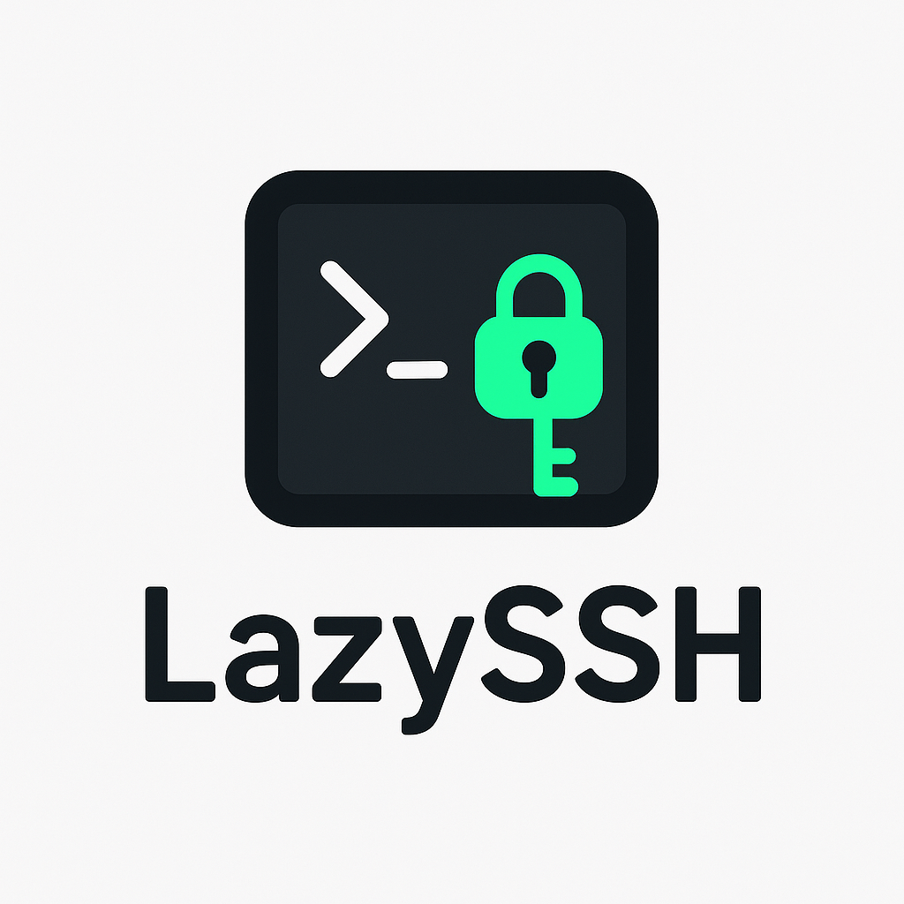
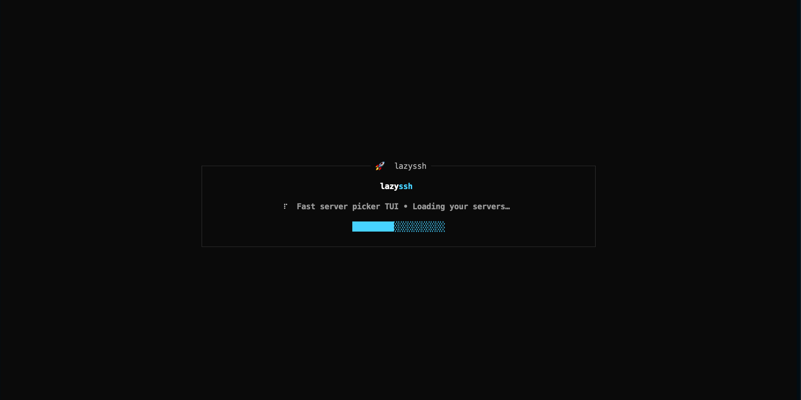
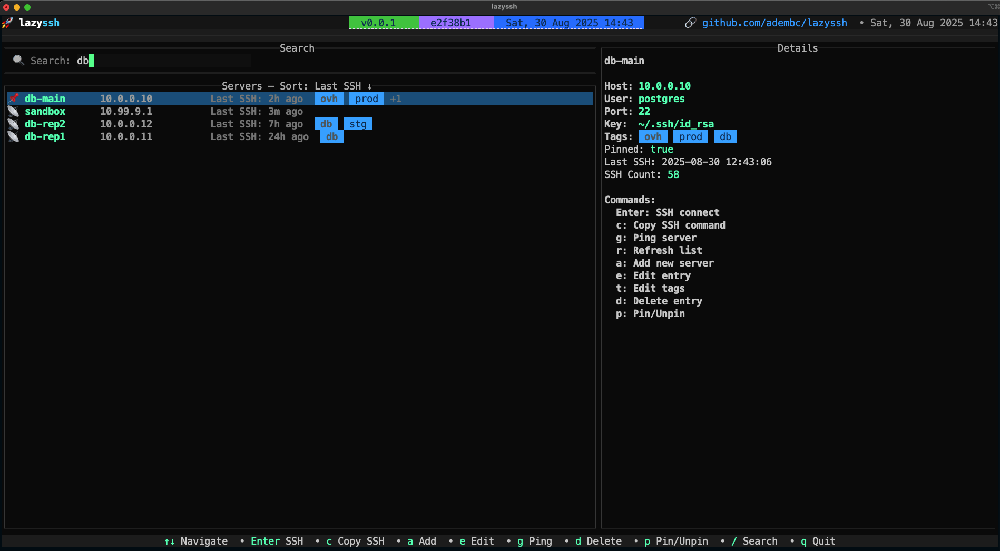
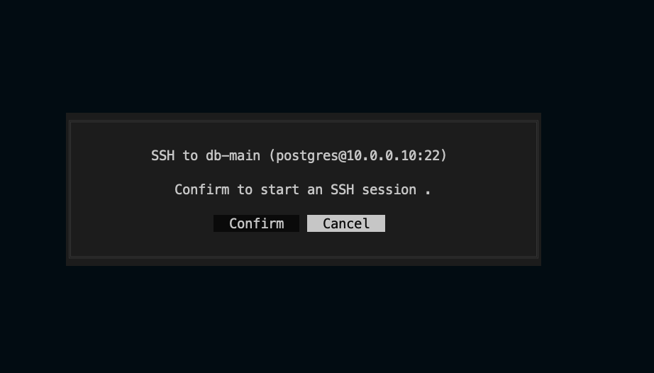

<div align="center">
  
</div>

---

Lazyssh is a terminal-based, interactive SSH manager inspired by tools like lazydocker and k9s — but built for managing your fleet of servers directly from your terminal.
<br/>
With lazyssh, you can quickly navigate, connect, manage, and transfer files between your local machine and any server defined in your ~/.ssh/config. No more remembering IP addresses or running long scp commands — just a clean, keyboard-driven UI.
## 🎥 Demo

<div align="center">
  <figure>
    
    <figcaption>Startup splash / loader</figcaption>
  </figure>
  <br/>
  <figure>
    
    <figcaption>Scrollable server list with pins and status</figcaption>
  </figure>
  <br/>
  <figure>
    
    <figcaption>Fuzzy search to quickly filter servers</figcaption>
  </figure>
  <br/>
  <figure>
    
    <figcaption>Add a new server via the UI form</figcaption>
  </figure>
  <br/>
  <figure>
    
    <figcaption>SSH into the selected server</figcaption>
  </figure>
</div>


## ✨ Features

### Server Management (current)
- 📜 Read & display servers from your `~/.ssh/config` in a scrollable list.
- ➕ Add a new server from the UI by specifying alias, host/IP, username, port, identity file.
- ✏ Edit existing server entries directly from the UI.
- 🗑 Delete server entries safely.
- 📌 Pin / unpin servers to keep favorites at the top.
- 🏓 Ping server to check status.

### Quick Server Navigation
- 🔍 Fuzzy search by alias, IP, or tags.
- 🖥 One‑keypress SSH into the selected server (Enter).
- 🏷 Tag servers (e.g., prod, dev, test) for quick filtering.
- ↕️ Sort by alias or last SSH (toggle + reverse).


### Upcoming
- 📁 Copy files between local and servers with an easy picker UI.
- 📡 Port forwarding (local↔remote) from the UI.
- 🔑 Enhanced Key Management:
  - Use default local public key (~/.ssh/id_ed25519.pub or ~/.ssh/id_rsa.pub)
  - Paste custom public keys manually
  - Generate new keypairs and deploy them
  - Automatically append keys to ~/.ssh/authorized_keys with correct permissions
---

## 📦 Installation

### Option 1: Download Binary from Release

Download the latest release from [GitHub Releases](https://github.com/Adembc/lazyssh/releases):

```bash
# Download and extract (example)
curl -JLO https://github.com/Adembc/lazyssh/releases/download/v0.1.0/lazyssh-darwin-arm64.tar.gz
tar -xzf lazyssh-darwin-arm64.tar.gz

# Make it executable and move to PATH
chmod +x  lazyssh-darwin-arm64
sudo mv lazyssh-darwin-arm64 /usr/local/bin/lazyssh

# run it
lazyssh
```

### Option 2: Build from Source

Requires **Go 1.22+**

```bash
# Clone the repository
git clone https://github.com/Adembc/lazyssh.git
cd lazyssh

# Build for macOS
make build
./bin/lazyssh

# Or Run it directly
make run
```

---

## ⌨️ Key Bindings

| Key | Action |
|---|---|
| / | Toggle search bar |
| ↑/↓ | Navigate servers |
| Enter | SSH into selected server |
| c | Copy SSH command to clipboard |
| g | Ping selected server |
| r | Refresh background data |
| a | Add server |
| e | Edit server |
| t | Edit tags |
| d | Delete server |
| p | Pin/Unpin server |
| s | Toggle sort field |
| S | Reverse sort order |
| q | Quit |

Tip: The hint bar at the top of the list shows the most useful shortcuts.

---

## 🙏 Acknowledgments

- Built with [tview](https://github.com/rivo/tview) and [tcell](https://github.com/gdamore/tcell).
- Inspired by [k9s](https://github.com/derailed/k9s) and [lazydocker](https://github.com/jesseduffield/lazydocker).

